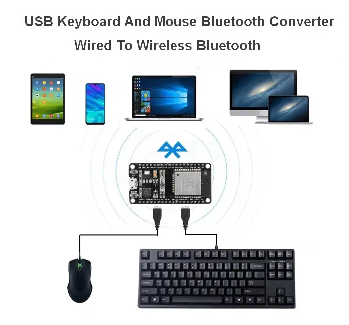
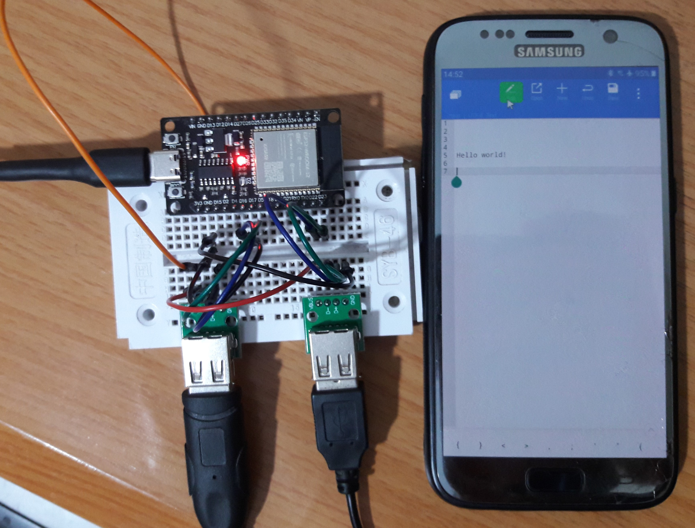

# USB Keyboard And Mouse Bluetooth Adapter based on ESP32

This project aims to create a Bluetooth adapter using an ESP32 that allows users to connect USB keyboards and mice wirelessly to their devices.

## Hardware Requirements

To build and use this project, you will need the following:

-   ESP32-WROOM-32 development board
-   USB keyboard
-   USB mouse
-   Jumper wires

## Software Requirements

To program the ESP32, you will need:

-   Arduino IDE
-   ESP32 board support package installed in Arduino IDE

## Pin Configuration

The following pin configuration is used for the project:

-   Pin 16: USB port 1 data +
-   Pin 17: USB port 1 data -
-   Pin 22: USB port 2 data +
-   Pin 23: USB port 2 data -

## Image of the Prototype

Here's an image of the prototype in action:

## Testing

The code has been tested on an ESP32-WROOM-32 development board.

Other ESP32 boards may be compatible but have not been tested.

## Troubleshooting

If you encounter any issues or have questions, feel free to open an issue in the project's GitHub repository.

## Contributing

Contributions are welcome! If you'd like to contribute to the project, please fork the repository and submit a pull request.

## License

This project is licensed under the MIT License - see the `LICENSE` file for details.

## Credits

Credits to [T-vK](https://github.com/T-vK) for [ESP32-BLE-Keyboard](https://github.com/T-vK/ESP32-BLE-Keyboard) and [ESP32-BLE-Mouse](https://github.com/T-vK/ESP32-BLE-Mouse) Arduino libraries. Also, credits to [tobozo](https://github.com/tobozo) for [ESP32-USB-Soft-Host](https://github.com/tobozo/ESP32-USB-Soft-Host) library as this project is heavily based on their work!